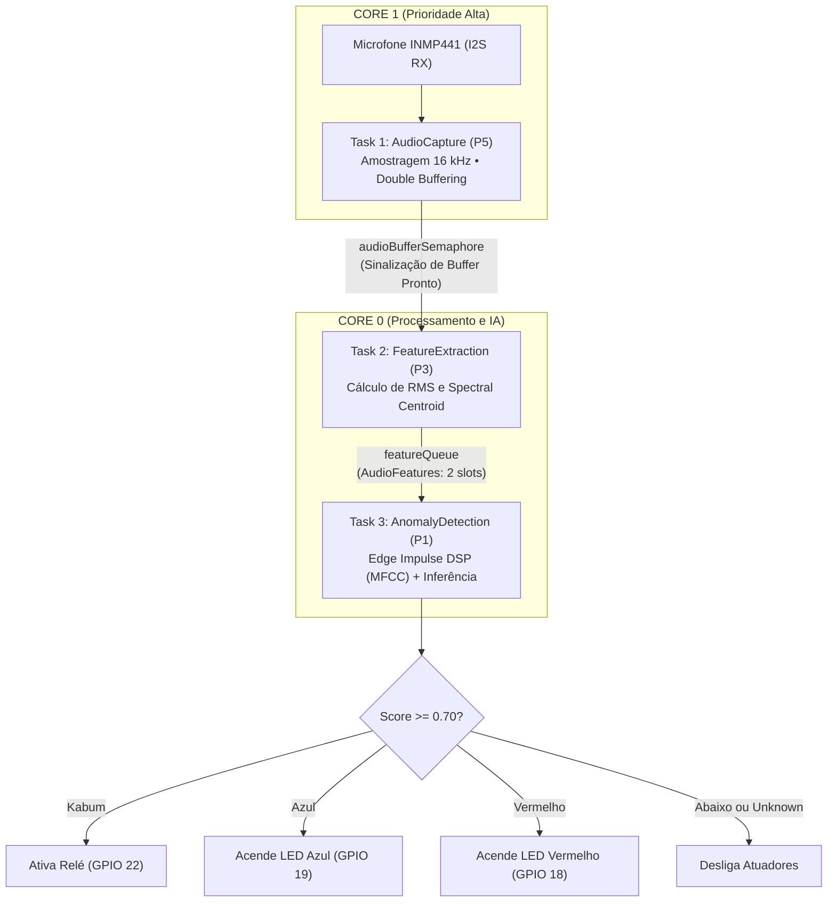
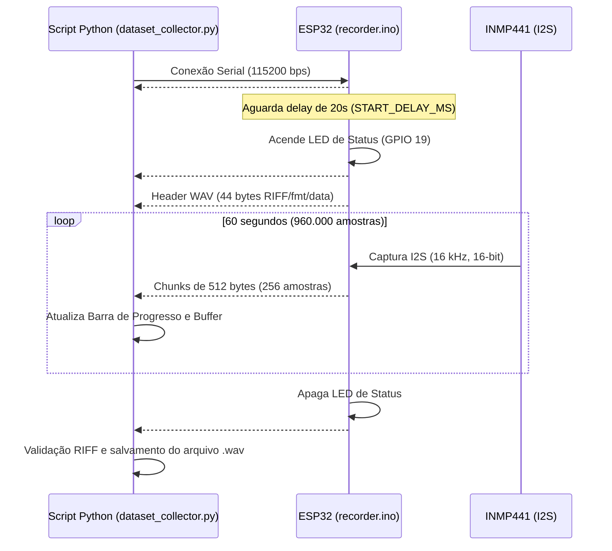

# TinyML no ESP32 — Reconhecimento e Classificação de Áudio com Edge Impulse e FreeRTOS

Sistema embarcado em tempo real para detecção e classificação de comandos de voz / eventos acústicos executado em um **ESP32**, integrado a um microfone digital I2S (**INMP441**) e atuadores físicos (módulo relé e LEDs indicadores). O processamento utiliza modelos quantizados gerados via **Edge Impulse**, estruturado em uma arquitetura multitarefa e multicore com **FreeRTOS**.

---

## 📋 Visão Geral

O projeto contempla o ciclo completo de TinyML aplicado a áudio:
1. **Coleta e Streaming de Áudio**: Firmware no ESP32 para gravação de áudio digital a 16 kHz via I2S e transmissão serial de arquivos WAV canônicos de 60 segundos, sincronizados com um script Python com barra de progresso em tempo real.
2. **Treinamento e Modelagem**: Classificador treinado para identificar palavras-chave específicas (**"Kabum"**, **"Azul"**, **"Vermelho"**) e ruído de fundo (**"unknown"**).
3. **Inferência Embarcada em Tempo Real**: Execução contínua com técnica de *double buffering*, extração de métricas acústicas em tempo de execução (RMS e Spectral Centroid) e inferência com Edge Impulse SDK, distribuídos entre os dois núcleos do ESP32.
4. **Atuação Física**: Acionamento seletivo de relé e LEDs conforme a classe reconhecida e threshold de confiança.

---

## 🗂️ Estrutura do Repositório

```text
TinyML_Esp32/
├── classification/
│   └── classification.ino      # Firmware principal: inferência TinyML com FreeRTOS multicore
├── recorder/
│   └── recorder.ino            # Firmware para coleta: grava 60s a 16 kHz e envia WAV via serial
├── dataset_collector.py        # Script Python para recepção serial do áudio e geração de .wav
├── kabum_model.tflite          # Modelo quantizado TensorFlow Lite para microcontroladores
├── kabum_model.onnx            # Modelo em formato aberto ONNX (para validação/entregáveis)
├── lib.zip                     # Biblioteca C++ do Edge Impulse pronta para Arduino IDE (Kabum_inferencing)
└── README.md                   # Documentação completa do projeto
```

---

## 🔌 Pinagem e Conexões de Hardware

### 1. Microfone I2S (INMP441)
O microfone digital comunica-se diretamente com o periférico de hardware I2S do ESP32:

| Pino INMP441 | Pino ESP32 | Função | Observação |
| :--- | :--- | :--- | :--- |
| **SCK / BCLK** | **GPIO 26** | Bit Clock | Clock serial contínuo |
| **WS / LRC** | **GPIO 25** | Word Select | Seleção de canal (Left/Right) |
| **SD / DATA** | **GPIO 33** | Serial Data | Linha de dados de áudio |
| **VDD** | **3.3V** | Alimentação | **Atenção:** usar linha 3.3V (não usar 5V) |
| **GND** | **GND** | Terra comum | Referência elétrica |
| **L/R** | **GND** | Seleção de Canal | Conectado ao GND para canal esquerdo (mono) |

### 2. Atuadores e LEDs

| Dispositivo | Pino ESP32 | Modo | Comportamento |
| :--- | :--- | :--- | :--- |
| **LED Vermelho** | **GPIO 18** | Saída Digital | Acende quando a classe **"Vermelho"** é detectada |
| **LED Azul** / Status | **GPIO 19** | Saída Digital | Acende quando a classe **"Azul"** é detectada (ou status de gravação no `recorder`) |
| **Módulo Relé** | **GPIO 22** | Saída Digital (*Active-LOW*) | Liga quando a classe **"Kabum"** é detectada (`LOW` = Ligado / `HIGH` = Desligado) |

> [!NOTE]
> Para evitar pulsos espúrios ao ligar o ESP32 (especialmente no relé), os pinos são configurados com seu estado de repouso antes de acionar a direção de saída (`OUTPUT`).

---

## ⚙️ Arquitetura de Software e FreeRTOS

O firmware de classificação (`classification/classification.ino`) utiliza uma divisão em **3 tarefas FreeRTOS** distribuídas entre os núcleos **Core 0** e **Core 1** do ESP32:



### Detalhamento das Tasks

| Tarefa | Prioridade | Núcleo | Stack | Descrição |
| :--- | :---: | :---: | :---: | :--- |
| **`task_audio_capture`** | **5** (Alta) | **Core 1** | 8192 B | Lê blocos de 32-bit do DMA do I2S, aplica deslocamento de 14 bits para int16 saturado e alterna o preenchimento de `audio_buffer_a` e `audio_buffer_b` (*double buffering*). Ao encher uma janela de 1 segundo (16.000 amostras), sinaliza via `audioBufferSemaphore`. |
| **`task_feature_extraction`** | **3** (Média) | **Core 0** | 8192 B | Aguarda a liberação do semáforo, recupera o buffer preenchido sob proteção atômica (`portMUX_TYPE`), calcula descritores físicos (energia RMS e Spectral Centroid) e despacha a estrutura `AudioFeatures` para a `featureQueue`. |
| **`task_anomaly_detection`** | **1** (Baixa) | **Core 0** | 8192 B | Consome as features da fila, normaliza o sinal para ponto flutuante `[-1.0, 1.0]`, executa o bloco DSP e a inferência da rede neural via `run_classifier()`, reporta os tempos e aciona os periféricos correspondentes. |

---

## 🎯 Classes e Lógica de Atuação

O modelo possui **4 classes**:
- `Kabum`
- `Azul`
- `Vermelho`
- `unknown` (ruídos do ambiente, silêncio ou palavras fora do vocabulário)

### Regra de Decisão
- **Threshold de Confiança**: `CONFIDENCE_THRESHOLD = 0.70` (70%).
- Apenas uma classe pode acionar o circuito por janela. Antes de qualquer acionamento, todos os atuadores são desligados para evitar sobreposição de estados.

| Classe Reconhecida | Probabilidade | Estado do Relé (GPIO 22) | LED Azul (GPIO 19) | LED Vermelho (GPIO 18) |
| :---: | :---: | :---: | :---: | :---: |
| **`Kabum`** | $\ge 0.70$ | **LIGADO** (`LOW`) | Desligado (`LOW`) | Desligado (`LOW`) |
| **`Azul`** | $\ge 0.70$ | Desligado (`HIGH`) | **LIGADO** (`HIGH`) | Desligado (`LOW`) |
| **`Vermelho`** | $\ge 0.70$ | Desligado (`HIGH`) | Desligado (`LOW`) | **LIGADO** (`HIGH`) |
| **`unknown` ou $< 0.70$** | $< 0.70$ | Desligado (`HIGH`) | Desligado (`LOW`) | Desligado (`LOW`) |

---

## 🎙️ Pipeline de Coleta de Dados (Dataset Collector)

Para gerar novos dados de treinamento ou expandir o dataset, o repositório disponibiliza um conjunto integrado de gravação em streaming.



### Como Utilizar:

1. **Grave o firmware no ESP32**:
   Abra `recorder/recorder.ino` na Arduino IDE e faça o upload para a placa.
2. **Feche o Monitor Serial** da Arduino IDE para liberar a porta serial.
3. **Instale as dependências Python**:
   ```bash
   pip install pyserial
   ```
4. **Execute o coletor**:
   - No Linux:
     ```bash
     python dataset_collector.py --port /dev/ttyUSB0 --out gravacao.wav
     ```
   - No Windows:
     ```bash
     python dataset_collector.py --port COM3 --out gravacao.wav
     ```
5. **Aguarde o ciclo**:
   - O ESP32 envia `##READY##` e inicia uma contagem de **20 segundos** para você se posicionar.
   - O LED no pino 19 acende e a gravação de **60 segundos** se inicia.
   - O script exibe a barra de progresso com taxa em KB/s e ETA.
   - Ao finalizar, o arquivo `.wav` (PCM 16 kHz mono) estará salvo no destino indicado.
6. **Pós-processamento**:
   - Abra o áudio no **Audacity** (ou ferramenta similar).
   - Recorte cada amostra/palavra em segmentos de 1 segundo.
   - Importe no **Edge Impulse Studio** (*Data acquisition → Upload data*).

---

## 🚀 Como Executar o Sistema de Classificação

### 1. Pré-requisitos
- [Arduino IDE](https://www.arduino.cc/en/software) (versão 2.x recomendada).
- Pacote de suporte às placas ESP32 instalado no Gerenciador de Placas (`esp32` por Espressif Systems).
- Cabo Micro-USB / USB-C para comunicação e gravação.

### 2. Instalação da Biblioteca TinyML (`lib.zip`)
O arquivo `lib.zip` contém a biblioteca exportada do Edge Impulse com o modelo e o motor de inferência:
1. Abra a Arduino IDE.
2. Vá em **Sketch** → **Incluir Biblioteca** → **Adicionar biblioteca .ZIP...**
3. Selecione o arquivo `lib.zip` na raiz deste repositório.
4. A biblioteca `Kabum_inferencing` ficará disponível para os seus sketches.

### 3. Compilação e Gravação
1. Abra o arquivo `classification/classification.ino` na Arduino IDE.
2. Selecione a sua placa: **ESP32 Dev Module** (ou modelo correspondente da sua placa).
3. Selecione a porta serial correta.
4. Clique em **Upload**.

### 4. Monitoramento Serial
Abra o Monitor Serial configurado para **115200 baud**. Você verá o log de inicialização e as saídas periódicas de inferência:

```text
======================================
     KABUM - DETECTOR DE ANOMALIAS
======================================
Sample rate    : 16000 Hz
Window samples : 16000
Window duration: 1.00 s
Threshold      : 0.70
Inicializando I2S...
I2S OK

======================================
Sistema FreeRTOS iniciado!
Task 1: AudioCapture      | P5 | Core 1
Task 2: FeatureExtraction | P3 | Core 0
Task 3: AnomalyDetection  | P1 | Core 0
======================================

[TASK 1] 16000 samples em 1000120 us
[TASK 2] RMS: 0.0821 | Centroid: 1420.5 Hz | 1845 us

========== RESULTADO ==========
  Azul       : 0.02150
  Kabum      : 0.94210
  Vermelho   : 0.01120
  unknown    : 0.02520
  Inferencia    : 18230 us
  Feature extr. : 1845 us
>>> KABUM DETECTADO! — Relê LIGADO
================================
```

---

## 📦 Modelos Exportados

| Arquivo | Formato | Aplicação |
| :--- | :--- | :--- |
| `kabum_model.tflite` | FlatBuffers / TFLite (INT8 quantizado) | Modelo compilado para microcontroladores compatível com TensorFlow Lite for Microcontrollers. |
| `kabum_model.onnx` | Open Neural Network Exchange (.onnx) | Formato aberto para validação em pipelines Python, auditoria e entregáveis acadêmicos. |
| `lib.zip` | Código C++ compilável | Pacote completo contendo extratores DSP (MFCC), kernels e código de inferência pronto para embarcar. |

---

## 🛠️ Resolução de Problemas Comuns

- **Porta serial ocupada / erro de abertura (`Permission denied` ou `Port busy`)**:
  - Certifique-se de que o Monitor Serial da Arduino IDE está fechado antes de rodar o `dataset_collector.py`.
  - No Linux, garanta acesso ao grupo `dialout`: `sudo usermod -a -G dialout $USER`.
- **Ruído excessivo ou falta de sinal do microfone**:
  - Verifique se o pino `L/R` do INMP441 está firmemente aterrado ao `GND`.
  - Cheque as conexões de `SCK (GPIO 26)`, `WS (GPIO 25)` e `SD (GPIO 33)`.
- **Relé aciona no boot do ESP32**:
  - O código já inicia o pino em `HIGH` antes de definir `pinMode(RELE, OUTPUT)`. Caso utilize um relé *active-HIGH*, inverta as macros `RELE_ON` e `RELE_OFF` no início do `classification.ino`.

---

## 👥 Autor e Contexto

Desenvolvido por **Danilo Martins Merlo** no âmbito das atividades práticas de **TinyML e Sistemas Inteligentes Embarcados** (Inteli - M11).
